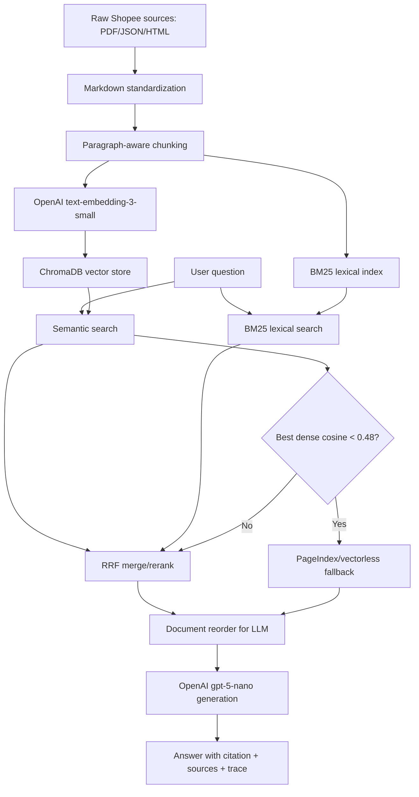

# Báo Cáo Nhóm - E-commerce Support RAG Chatbot

## 1. Thông Tin Nhóm

| Thành viên | MSSV | Vai trò | Trách nhiệm chính |
|---|---|---|---|
| Nguyễn Tuấn Đức | 2A202601380 | Nhóm trưởng, RAG Architect | Thiết kế kiến trúc RAG, retrieval pipeline, cấu hình model, điều phối tích hợp và demo |
| Nguyễn Việt Phong | 2A202601975 | Data & Indexing Engineer | Thu thập dữ liệu, chuẩn hoá markdown, chunking và indexing vào ChromaDB |
| Lê Trọng Việt Dũng | 2A202601746 | Retrieval & Evaluation Engineer | Semantic search, BM25, RRF reranking, RAGAS golden dataset và evaluation |
| Ngô Quang Anh | 2A202601106 | Demo UI & QA Engineer | Giao diện chatbot demo, source display, agent trace, smoke test và kiểm thử cuối |

## 2. Mục Tiêu Sản Phẩm

Nhóm xây dựng một hệ thống RAG chatbot hỗ trợ trả lời câu hỏi về chính sách thương mại điện tử và hỗ trợ khách hàng, tập trung vào kho tài liệu Shopee Vietnam.

Hệ thống phải đáp ứng các yêu cầu chính:

- Trả lời dựa trên bằng chứng từ tài liệu đã thu thập.
- Có citation/source rõ ràng.
- Kết hợp semantic search, lexical search và reranking.
- Có fallback khi vector search không đủ bằng chứng.
- Có demo UI hiển thị quá trình agent xử lý, nguồn truy xuất và các tham số retrieval.
- Có evaluation pipeline bằng RAGAS với 4 chỉ số: faithfulness, answer relevancy, context recall, context precision.

## 3. Phạm Vi Dữ Liệu

Nguồn dữ liệu được lấy từ các trang hỗ trợ/chính sách công khai của Shopee Vietnam, gồm:

- Chính sách trả hàng và hoàn tiền.
- Thời gian nhận tiền hoàn và cách kiểm tra tiền hoàn.
- Phương thức gửi hàng hoàn trả và phí hoàn trả.
- Quy trình Shopee xử lý yêu cầu trả hàng/hoàn tiền.
- Quản lý đơn trả hàng/hoàn tiền cho người bán.
- Chính sách bảo mật.
- Điều khoản dịch vụ.
- Quy chế hoạt động sàn thương mại điện tử Shopee.vn.
- Điều khoản dịch vụ Shopee Mall.

Kho dữ liệu sau chuẩn hoá nằm tại:

- `data/landing/legal/`
- `data/landing/news/`
- `data/standardized/legal/`
- `data/standardized/news/`

Giới hạn quan trọng: demo chỉ có bằng chứng về Shopee. Với câu hỏi về Lazada, Tiki hoặc sàn khác, hệ thống không trả lời bịa mà yêu cầu hỏi lại theo phạm vi Shopee hoặc cung cấp thêm tài liệu.

## 4. Kiến Trúc Hệ Thống



## 5. Pipeline Kỹ Thuật

### 5.1 Data Collection & Standardization

Nhóm thu thập dữ liệu từ nguồn Shopee công khai và chuẩn hoá về markdown. Mỗi tài liệu giữ metadata về nguồn, loại tài liệu và vai trò khách hàng khi có thể xác định.

Kết quả:

- Có đủ legal documents.
- Có đủ news/support articles.
- Có markdown trong `data/standardized/`.
- Loại bỏ các nguồn trùng lặp để tránh nhiễu retrieval.

### 5.2 Chunking & Indexing

Chiến lược chunking:

- `paragraph_recursive`
- `CHUNK_SIZE = 1000`
- `CHUNK_OVERLAP = 120`

Lý do chọn:

- Tài liệu chính sách có nhiều đoạn dài và tiêu đề/phần mục.
- Chunk theo paragraph giữ ngữ cảnh tốt hơn cắt cố định.
- Overlap 120 ký tự giúp giảm mất thông tin ở biên chunk mà vẫn tiết kiệm token.

Embedding:

- Model: `text-embedding-3-small`
- Dimension: `1536`
- Lý do: chi phí thấp, ổn định, setup nhanh hơn model local.

Vector store:

- ChromaDB
- Thư mục: `chroma_db/`
- Similarity: cosine

### 5.3 Retrieval

Pipeline retrieval gồm:

- Semantic search từ ChromaDB.
- BM25 lexical search.
- RRF reranking để hợp nhất dense + sparse.
- PageIndex fallback khi cosine gốc tốt nhất thấp hơn ngưỡng.

Ngưỡng fallback:

- `score_threshold = 0.48`
- So sánh với cosine gốc từ dense retrieval, không so với RRF.

Lý do:

- RRF score chỉ phản ánh thứ hạng sau fusion, thường rất nhỏ khoảng `0.03`.
- RRF không phải confidence và không nên dùng để quyết định thiếu bằng chứng.
- Cosine gốc phản ánh độ liên quan vector tốt hơn cho fallback.

### 5.4 Generation

Model sinh câu trả lời:

- OpenAI `gpt-5-nano`

Quy tắc trả lời:

- Chỉ dùng context được retrieve.
- Câu trả lời có citation.
- Nếu thiếu bằng chứng thì không bịa.
- Nếu câu hỏi ngoài phạm vi Shopee thì yêu cầu hỏi lại hoặc cung cấp thêm nguồn.

Document reorder:

- Áp dụng pattern đưa các chunk quan trọng ra đầu và cuối prompt.
- Mục tiêu giảm hiện tượng "lost in the middle".

## 6. Demo UI

Demo nằm trong thư mục `demo_ui/` và không ảnh hưởng đến code gốc trong `src/`.

Tính năng chính:

- Chatbot RAG chạy local.
- Streaming answer.
- Chọn sẵn golden testcase.
- Chỉnh runtime parameters:
  - `top_k`
  - `score_threshold`
  - bật/tắt RRF rerank
  - bật/tắt OpenAI answer
- Agent trace hiển thị ngay trong câu trả lời và ở panel inspector.
- Retrieval sources hiển thị:
  - `vector sim`
  - `RRF`
  - raw score
  - retrieval source
  - document type
  - customer role
- Guard chống hallucination cho câu hỏi ngoài phạm vi hoặc thiếu bằng chứng.

Chạy demo:

```powershell
conda activate vmec-clinical-copilot
python demo_ui\server.py
```

Mở trình duyệt:

```text
http://127.0.0.1:8765
```

Smoke test:

```powershell
python demo_ui\smoke_test.py
```

## 7. Evaluation Bằng RAGAS

Framework sử dụng:

- RAGAS

LLM judge:

- OpenAI `gpt-5-nano`

Golden dataset:

- File: `group_project/evaluation/golden_dataset.json`
- Số lượng: 20 câu hỏi
- Khi chạy chính thức: dùng `RAGAS_LIMIT=15` để đáp ứng yêu cầu tối thiểu và tối ưu chi phí.

Metrics:

- Faithfulness
- Answer relevancy
- Context recall
- Context precision

A/B configs:

- Config A: hybrid semantic + BM25 + RRF rerank + PageIndex fallback.
- Config B: hybrid semantic + BM25, không rerank, có PageIndex fallback.

Chạy evaluation:

```powershell
conda activate vmec-clinical-copilot
$env:PYTHONIOENCODING="utf-8"
$env:RAGAS_LIMIT="15"
python -m group_project.evaluation.eval_pipeline
```

Kết quả được xuất vào:

```text
group_project/evaluation/results.md
```

## 8. Kết Quả RAGAS

Kết quả gần nhất trên 15 câu hỏi:

| Metric | Config A: hybrid + RRF | Config B: hybrid no rerank | Delta |
|---|---:|---:|---:|
| Faithfulness | 0.992 | 0.971 | +0.020 |
| Answer relevancy | 0.860 | 0.866 | -0.006 |
| Context recall | 0.933 | 0.933 | +0.000 |
| Context precision | 0.745 | 0.752 | -0.007 |
| Average | 0.883 | 0.881 | +0.002 |

Nhận xét:

- Config A có average cao hơn nhẹ, chủ yếu nhờ faithfulness tốt hơn.
- Context recall của hai config ngang nhau, cho thấy retriever thường lấy đủ bằng chứng chính.
- Context precision còn có thể cải thiện vì top_k lấy 5 chunks, một số câu hỏi đơn giản chỉ cần 1-2 chunks.
- Answer relevancy của Config B nhỉnh hơn rất nhẹ, nhưng chênh lệch nhỏ và không đủ để phủ nhận lợi ích faithfulness của RRF.

Kết luận:

- Chọn Config A cho demo cuối vì cân bằng tốt hơn và bám sát kiến trúc lab: semantic + BM25 + RRF + fallback.

## 9. Worst Performers

Ba câu có vấn đề nổi bật theo RAGAS:

| # | Question | Vấn đề chính | Hướng cải thiện |
|---:|---|---|---|
| 1 | Shopee hiện có hỗ trợ đổi hàng trực tiếp không? | Context recall thấp do câu trả lời nằm trong đoạn general return/refund nhưng retriever có thể lấy thêm đoạn rộng | Tăng ưu tiên chunk chứa cụm "chưa hỗ trợ đổi hàng" hoặc bổ sung query expansion |
| 2 | Nếu yêu cầu trả hàng/hoàn tiền hiển thị trạng thái Shopee đang xem xét thì khi nào người mua nhận được kết quả? | Context precision thấp vì top_k=5 lấy thêm nhiều chunk phụ | Giảm top_k cho câu hỏi fact ngắn hoặc thêm reranker cross-encoder |
| 3 | Nếu Shopee chấp nhận phương án Trả hàng & Hoàn tiền, người mua phải gửi trả hàng trong bao lâu? | Precision thấp do nhiều chunk cùng chủ đề trả hàng/hoàn tiền | Tách chunk nhỏ hơn ở phần quy trình xử lý và tăng trọng số BM25 cho cụm "6 ngày" |

## 10. Hạn Chế Và Cải Tiến

Hạn chế:

- Dữ liệu chỉ bao phủ Shopee, chưa bao phủ Lazada/Tiki.
- Một số markdown còn nhiễu nhẹ do nguồn crawl/convert.
- RRF score dễ gây hiểu nhầm nếu xem là confidence, nên demo đã tách riêng `vector sim` và `RRF`.
- PageIndex fallback phụ thuộc trạng thái upload document/API bên ngoài.

Cải tiến đề xuất:

- Làm sạch markdown sâu hơn ở các đoạn bị nhiễu encoding hoặc lặp header.
- Thêm query expansion cho các câu hỏi ngắn.
- Dùng cross-encoder reranker khi có budget để tăng context precision.
- Thêm conversation memory cho follow-up questions.
- Nếu mở rộng phạm vi sang Lazada/Tiki, cần thêm nguồn chính thức và golden dataset tương ứng.

## 11. Bonus & Câu Hỏi Demo

### 11.1 Vì sao cần `customer_role`?

Chính sách Shopee có phần dành cho Người mua, Người bán hoặc cả hai. Nếu không gắn `customer_role`, hệ thống có thể lấy nhầm đoạn seller để trả lời buyer. Metadata này cũng giúp demo giải thích rõ mỗi nguồn áp dụng cho đối tượng nào.

### 11.2 Vì sao chọn chunking theo cấu trúc thay vì chunk cố định?

Chunk cố định dễ cắt ngang câu hoặc tách heading khỏi nội dung. Nhóm dùng paragraph/heading-aware chunking với overlap vừa phải để giữ ngữ cảnh chính sách, giảm nhiễu và vẫn không làm chunk quá dài.

### 11.3 Vì sao dùng OpenAI `text-embedding-3-small`?

Model local như `BAAI/bge-m3` tốt cho tiếng Việt nhưng setup nặng và dễ lỗi môi trường. `text-embedding-3-small` rẻ, ổn định, dễ chạy trong lab và đủ tốt cho tập tài liệu Shopee.

### 11.4 Vì sao cần BM25/TF-IDF nếu đã có vector search?

Vector search tốt cho truy vấn theo nghĩa, nhưng có thể bỏ sót cụm từ chính xác. BM25/TF-IDF dựa trên tần suất từ khóa và độ hiếm của từ trong corpus, nên phù hợp với các cụm như "Trả hàng/Hoàn tiền", "Shopee Mall", "đồng kiểm", "voucher". Đây là phần bonus nhóm có thể giải thích khi demo lexical retrieval.

### 11.5 Vì sao dùng RRF reranking?

Điểm cosine và điểm BM25 không cùng thang đo, nên cộng trực tiếp hai điểm sẽ sai. RRF chỉ dùng thứ hạng của mỗi retriever theo công thức `1 / (k + rank)`, giúp hợp nhất semantic và lexical search công bằng hơn.

### 11.6 Vì sao ngưỡng fallback là `0.48`?

Ngưỡng `0.48` được áp dụng trên cosine gốc của dense retrieval. Nếu `dense_results[0]["score"] < 0.48`, vector search chưa có bằng chứng đủ gần. Khi đó hệ thống chuyển sang PageIndex fallback hoặc từ chối trả lời nếu vẫn thiếu bằng chứng. Không dùng RRF score cho quyết định này vì RRF là điểm gộp thứ hạng, không phải confidence.

### 11.7 Vì sao cần reorder context?

LLM thường chú ý mạnh hơn vào đầu và cuối prompt, còn thông tin ở giữa dễ bị bỏ sót. Reorder context giúp đưa các đoạn quan trọng ra vị trí dễ được LLM sử dụng hơn, giảm hiện tượng lost-in-the-middle.

### 11.8 Vì sao bắt buộc citation?

Citation giúp người dùng kiểm chứng câu trả lời, giúp demo minh bạch nguồn và giảm rủi ro hallucination. Nếu không có nguồn đủ mạnh, chatbot phải hỏi lại hoặc nói chưa đủ bằng chứng thay vì tự suy diễn.

## 12. Cách Chạy Toàn Bộ

### 12.1 Cài đặt

```powershell
conda activate vmec-clinical-copilot
pip install -r requirements.txt
```

Tạo `.env` và điền:

```text
OPENAI_API_KEY=...
```

### 12.2 Tạo ChromaDB

```powershell
python -m src.task4_chunking_indexing
```

### 12.3 Chạy individual tests

```powershell
python -m pytest tests/test_individual.py -v
```

Kết quả kỳ vọng:

```text
35 passed
```

### 12.4 Chạy evaluation

```powershell
$env:PYTHONIOENCODING="utf-8"
$env:RAGAS_LIMIT="15"
python -m group_project.evaluation.eval_pipeline
```

### 12.5 Chạy demo

Terminal 1:

```powershell
python demo_ui\server.py
```

Terminal 2:

```powershell
python demo_ui\smoke_test.py
```

Mở:

```text
http://127.0.0.1:8765
```

## 13. Deliverables

| Deliverable | File/Folder | Trạng thái |
|---|---|---|
| Pipeline Task 1-10 | `src/`, `data/`, `chroma_db/` | Hoàn thành |
| Golden dataset | `group_project/evaluation/golden_dataset.json` | Hoàn thành, 20 Q&A |
| RAGAS pipeline | `group_project/evaluation/eval_pipeline.py` | Hoàn thành |
| RAGAS results | `group_project/evaluation/results.md` | Hoàn thành |
| Demo UI | `demo_ui/` | Hoàn thành |
| Group report | `group_project/README.md` | Hoàn thành |

## 14. Kết Luận

Nhóm đã hoàn thiện một RAG pipeline end-to-end cho bài toán E-commerce Support Chatbot trên dữ liệu Shopee Vietnam. Hệ thống có đầy đủ các thành phần quan trọng: data collection, markdown standardization, chunking/indexing, semantic search, BM25, RRF rerank, fallback, generation có citation, demo UI và RAGAS evaluation.

Kết quả RAGAS cho thấy pipeline có độ faithfulness cao và recall tốt. Config hybrid + RRF được chọn làm cấu hình cuối vì đạt average cao hơn nhẹ và phù hợp nhất với kiến trúc yêu cầu của lab.
